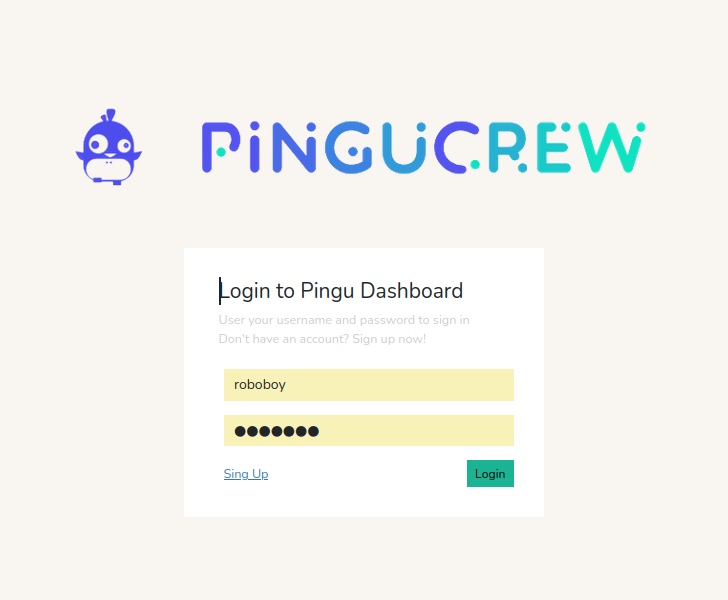
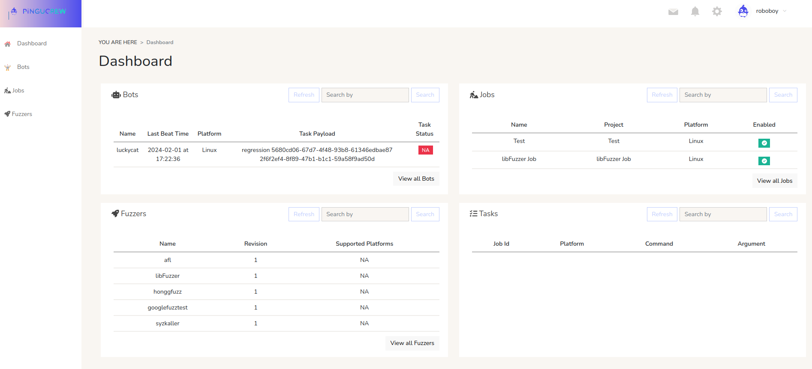
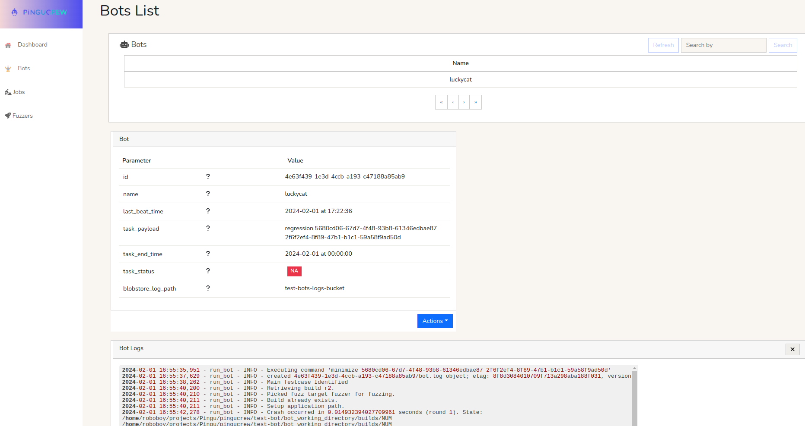
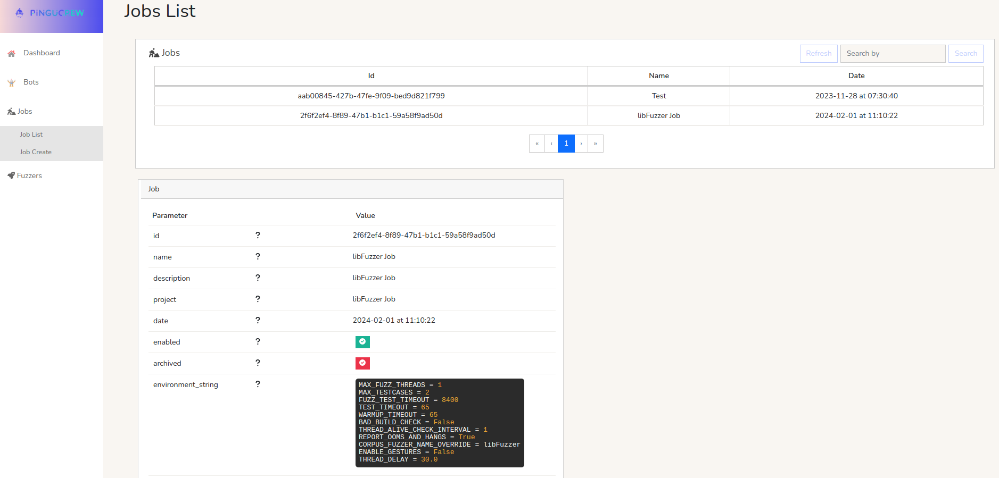
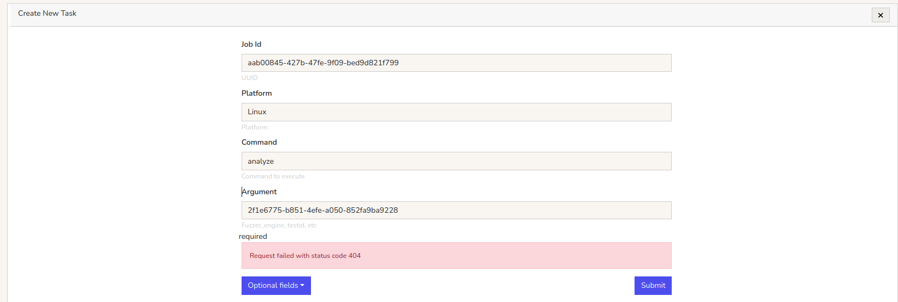
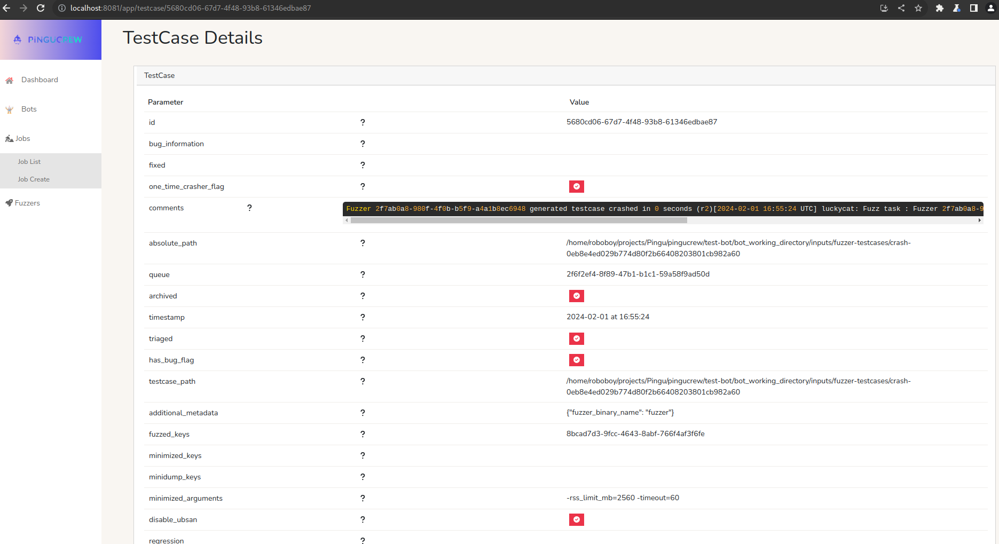
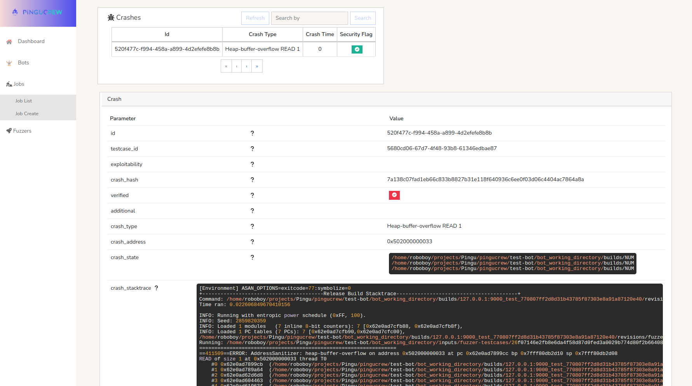

# Pingucrew frontend documentation.

## Login

The login section is the first section users will see when they navigate to the platform. By providing their credentials, users can access their account and all the features associated with it.

## Dashboard

The dashboard is the second section of the Pingucrei frontend, where users can get an overview of the platform. This section should display information about the platform, including the number of bots currently running, the number of jobs scheduled, and the number of test cases in the test suite. It should also display a graph showing the platform's overall performance and a quick overview of any pending tasks.

## Bots Page

The bots view is the third section of the Pingucrew frontend. This section should display a list of all the bots currently running on the platform, along with their status and any related tasks.

# Jobs Page

The jobs view is the fourth section of the Pingucrew frontend. This section should display a list of all the scheduled jobs on the platform, including their related test cases and any associated crashes. Users should be able to view the details of each task, along with any crashes that occurred during the execution of the job as well as creating new tasks assosiated to the current job for the bots to be executed.

## Test Cases Details and Crashes

The test cases details and crashes section is the fifth and final section of the Pingucrew frontend. This section should display information about the test cases in the test suite, including the name of the test case, any related crashes, and the status of the last run. Users should also be able to view the details of any crashes that occurred during the execution of the test case, including the stack trace and any associated error logs.

