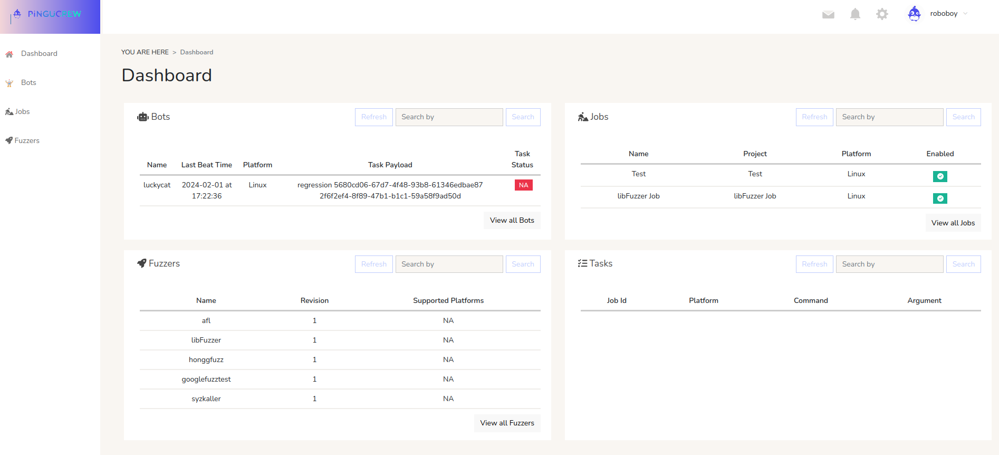
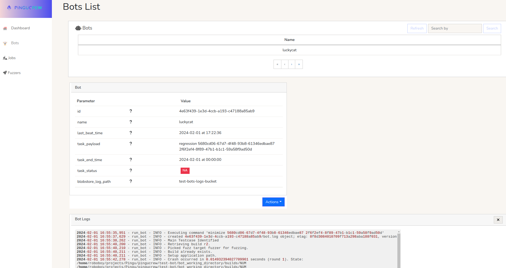
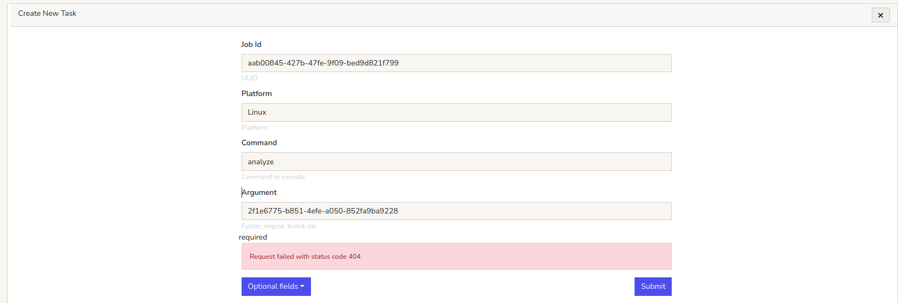
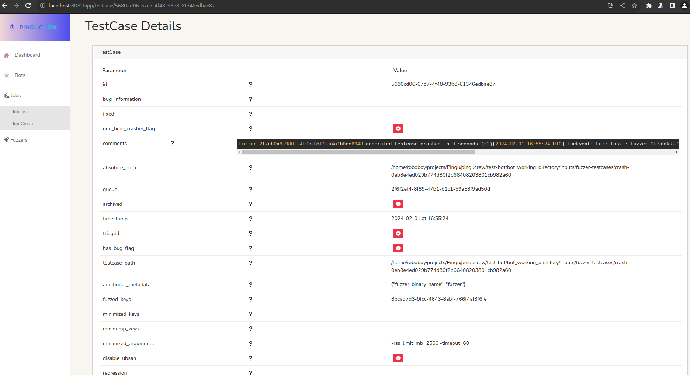
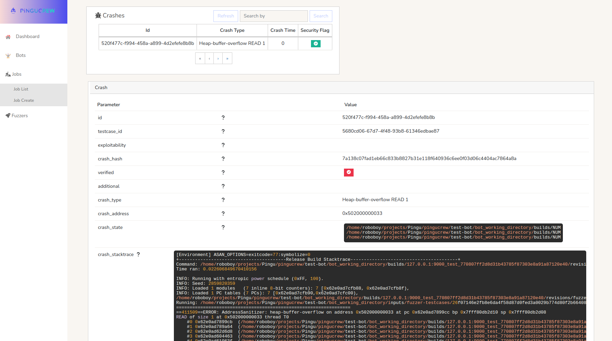

## Login

The login section is the first section users will see when they navigate to the platform. By providing their credentials, users can access their account and all the features associated with it.

## Project

The project section allows users to manage their projects. Users can view a list of existing projects, create new ones, and access project-specific details.

## Dashboard

The dashboard is the central hub of the Pingucrew frontend, where users can get an overview of the platform. This section displays information about the platform, including the number of bots currently running, the number of jobs scheduled, and the number of test cases in the test suite. It also includes graphs showing platform performance and a quick overview of pending tasks.

## Bots Page

The bots view displays a list of all the bots currently running on the platform, along with their status and any related tasks. Users can monitor bot activity and view detailed logs for debugging purposes.

## Jobs Page

The jobs view provides a list of all scheduled jobs on the platform. Users can view job details, including related test cases and associated crashes. Additionally, users can create new tasks for bots to execute within the context of a job.

## Tasks Page

The tasks page provides detailed information about individual tasks within a job. Each task includes parameters such as the task ID, associated job ID, command, arguments, creation time, end time, and status. This section also displays task logs, which provide a chronological record of the task's execution, including any warnings or errors encountered.

## Test Cases Details and Crashes

This section provides detailed information about test cases in the test suite, including their names, related crashes, and the status of the last run. Users can view crash details, including stack traces and error logs, to debug issues effectively.

## Coverage Explorer

The coverage explorer allows users to analyze code coverage data. It displays overall coverage percentages, file-specific coverage details, and highlights uncovered lines of code.

## Fuzzing Statistics

The fuzzing statistics section provides insights into the fuzzing process. It includes metrics such as the number of tests executed, crashes found, and edge coverage. A graph visualizes fuzzing metrics over time.

## Crash Statistics

The crash statistics section visualizes crash data across different dimensions, such as platforms and time. It includes bar charts, pie charts, and scatter plots to help users analyze crash trends and patterns.

